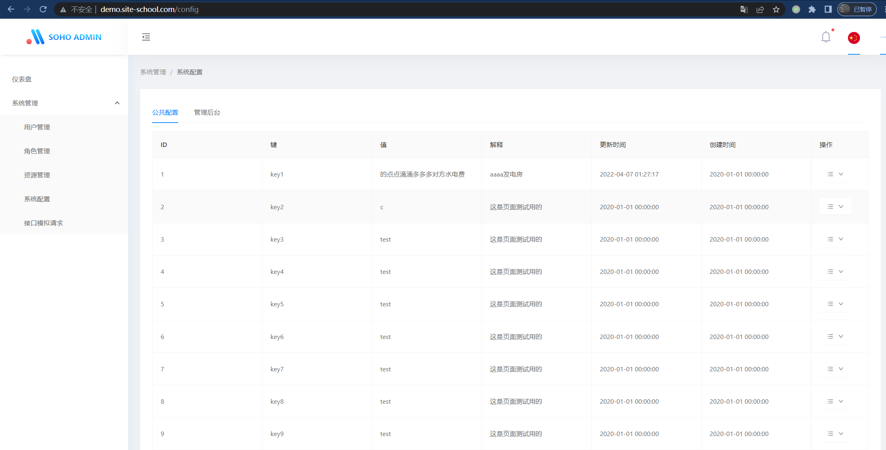

SOHO后台管理系统
==============

   

一款简单易用基于Spring boot开发的管理后台； 主要实现的功能有，菜单管理， 用户管理，权限管理， 角色管理， 鉴权， 以及一些基础组件库

功能列表
------

- 用户管理：后台用户配置管理
- 菜单管理: 前后端菜单资源管理，用来权限控制以及导航
- 角色管理: 管理后端角色管理，权限控制
- 系统配置: 系统可以灵活配置的相关配置管理；通过公共接口，可以快捷方便的访问系统后台配置信息，即时生效
- 字典配置： 后台配置字典管理，方便前端获取字典数据；业务开发可以快速实现字典数据的获取
- 系统通知: 后台配置通知管理，方便接收系统系统消息
- 登录日志: 后台登录授权日志；增强系统安全性
- 操作日志：后台系统API所有请求操作均记录日志，可以根据系统配置选择性记录请求方式（GET,POST,PUT,DELETE 对应的请求方式即不同的操作， GET:获取信息, POST: 创建 PUT:更新 DELETE：删除）
- 系统日志: 系统API级别日志；对系统API访问进行日志纪录，方便安全管理
- 定时任务：后台实时配置定时任务；无须重启服务配置即可生效，支持在线测试
- 代码生成: 简单的代码生成功能；支持groovy自定义代码生成，系统默认带有常用的生成代码，支持80%增删查改操作
- API接口: 系统默认集成了swagger；可以直接查看系统相关接口信息
- 审配流管理: 方便快速构建自己的审配流程； 后台动态配置审批流程，审配操作，审配开发利器
- 长链接模块: 方便快速开发即时通信类似的应用
- 内容系统: 满足大部分系统需要的内容发布处理
- 用户模块：方便快速的构建自己的用户功能
- 上传管理: 统一管理上传；使用引用计数方式可极大减少系统存储空间使用提高系统性能
- 微服务支持：单体开发模式，可以快速构建微服务（API桥接），实现系统解耦，提高系统可维护性，提高系统开发速度

预览地址
-------

- [预览地址](https://www.soho.work/)   演示账号： admin:123456
- [文档地址](https://docs.soho.work/)
- [前端仓库地址](https://gitee.com/fang/soho-admin-front)
- [相关技术文档](docs/learn/main.md)

## 项目演示图片

|      |                                     |
| ---- |-------------------------------------|
|   |  |
|       |    |
|   |  |

加入我们
-------

QQ群：569407926

